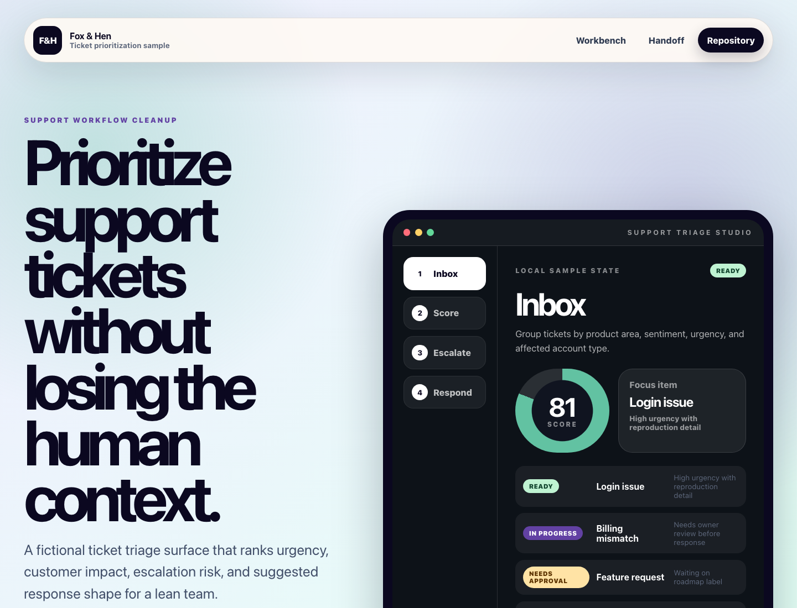

# Support Triage Studio

Public Fox & Hen working sample for a **support workflow cleanup**.



## Live Demo

- Demo: [https://foxhen-support-triage-studio.vercel.app](https://foxhen-support-triage-studio.vercel.app)
- Repository: [https://github.com/foxandhenllc/foxhen-support-triage-studio](https://github.com/foxandhenllc/foxhen-support-triage-studio)

## Purpose

Support triage board for clustering tickets, scoring urgency, drafting responses, and exporting fix queues.

## What This Demo Is

Support Triage Studio is a forkable React/Vite operating tool for teams that want to rank fictional tickets by urgency, customer impact, escalation risk, and response path. It is intentionally small, static, and public-safe so you can copy the pattern without inheriting a backend or vendor lock-in.

## Fully Working Behaviors

- Search, filter, and sort a domain-specific workflow board.
- Add a fictional item and edit owner, notes, priority, value, effort, and friction.
- Advance status and watch readiness metrics update in real time.
- Run a 24-hour sprint simulation to reduce friction on the highest-scoring work.
- Toggle QA gates, generate a handoff report, and download the board as JSON.

## Workflow Template

See [docs/workflow-template.md](docs/workflow-template.md) for the sample ticket triage and response loop, adaptation checklist, and public-safe data rules.

## Suggested Forks

- Replace sample tickets with fictionalized categories from your queue.
- Score value by customer impact and friction by missing context.
- Use checks as response quality gates.
- Export handoff JSON for macro writing or help desk setup.

## SEO / AIO Discoverability

**Plain-language answer:** Use this repo to cluster fictional support tickets, score urgency, draft response paths, and export a practical fix queue.

**Who it helps:** support teams, SaaS operators, and agencies cleaning up incoming tickets.

**Search intents covered:**

- support triage board
- ticket clustering tool
- customer support urgency scoring
- support fix queue template

**Why this repo is useful:** It separates customer communication from technical fixes so teams can prioritize root-cause work instead of reacting ticket by ticket.

## Local Run

```bash
npm install
npm run dev
npm run build
```

## Public-Safe Scope

This is a static React/Vite demo with fictional sample data. It includes no production data, credentials, real contacts, copied customer work, backend, auth, or external service calls.
